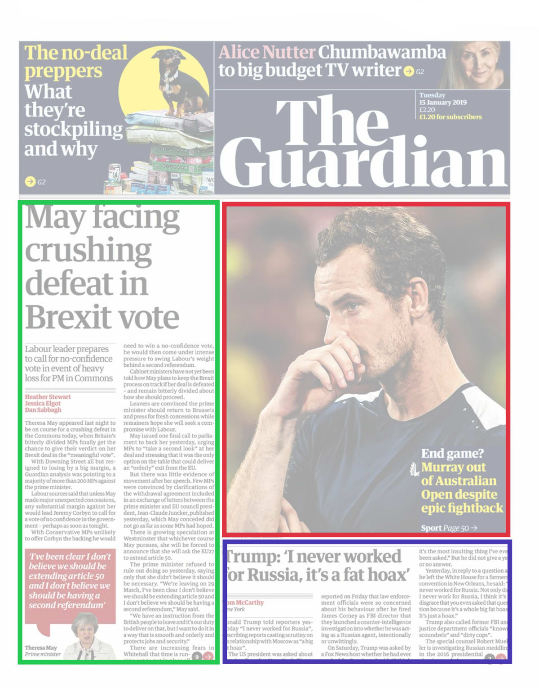
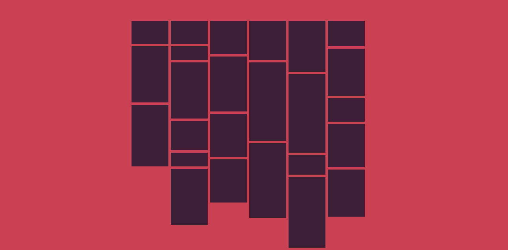

# Masonry Layout 
Web technology is constantly improving, and today developers have a formidable range of features at their disposal. This makes for a forward-thinking, innovative space — as it should — but also one at risk of being unrooted. **Every art has its ancient masters**. In the case of websites, it’s newspapers. 

Many web design best practices can be traced directly back to news design. When it comes down to it, websites are made for users to engage with, and hopefully return to. Newspapers have been playing that game for centuries, and winning.

Newspapers are pure content. From cover to cover, they are packed with information, information which needs to be well organised and well presented. The grid system is foundational to newspaper design. **As water shapes itself to a bowl, news content shapes itself to grid systems**.

Columns are the most important element of this. Depending on a newspaper’s format (tabloid, broadsheet, etc.) it might have anywhere from four to fourteen columns. It is rare for the content of newspapers not to shape themselves to these columns one way or another. Text flows down a column then resumes in the next one. Images can span multiple columns, especially if they’re eye-catching.

## Problem Statement 
Create a layout which resembles the Masonry/Grid Layout on the newspapers using Color Blocks as shown in the image below. 

### Details
1. There are atleast 25 blocks and each of them have different heights ([59px 143px 157px],[59px 35px 143px 75px 35px 143px], [85px 140px 110px],[100px 200px 190px], [130px 200px 50px 180px],[65px 120px 60px 110px 120px]). Each of these blocks have a fixed width of 100px. And all these blocks are placed inside 6 Columns.
2. The background color used for the block is `#3d1e37`
3. **Use CSS Floats to realize this layout**

